        Домашнее задание к занятию 6 «Создание собственных модулей»

1) Подготовка к выполнению

    Создайте пустой публичный репозиторий в своём любом проекте: my_own_collection.
    Скачайте репозиторий Ansible: git clone https://github.com/ansible/ansible.git по любому, удобному вам пути.
    Зайдите в директорию Ansible: cd ansible.
    Создайте виртуальное окружение: python3 -m venv venv.
    Активируйте виртуальное окружение: . venv/bin/activate. Дальнейшие действия производятся только в виртуальном окружении.

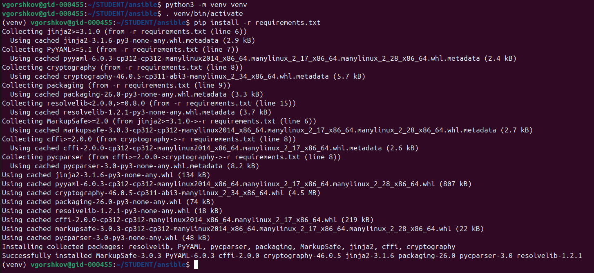
    
    Установите зависимости pip install -r requirements.txt.
    Запустите настройку окружения . hacking/env-setup.

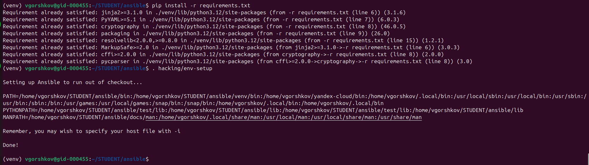

    Если все шаги прошли успешно — выйдите из виртуального окружения deactivate.

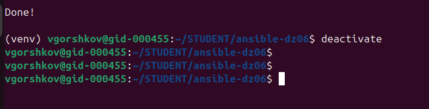

    Ваше окружение настроено. Чтобы запустить его, нужно находиться в директории ansible и выполнить конструкцию . venv/bin/activate && . hacking/env-setup.

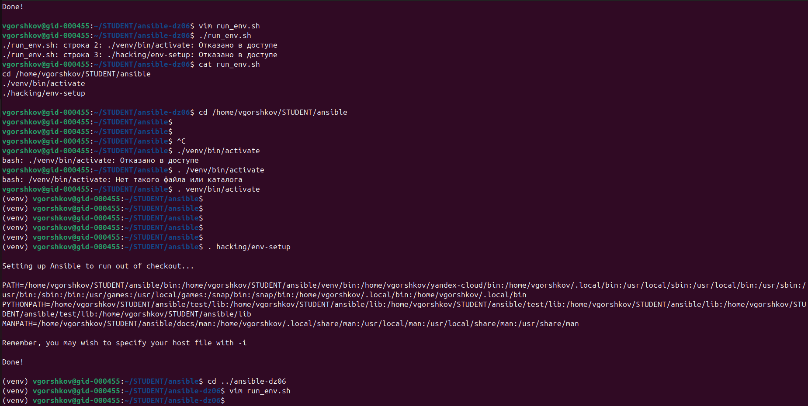

                   Основная часть

Ваша цель — написать собственный module, который вы можете использовать в своей role через playbook. Всё это должно быть собрано в виде collection и отправлено в ваш репозиторий.

Шаг 1. В виртуальном окружении создайте новый my_own_module.py файл.

Шаг 2. Наполните его содержимым:

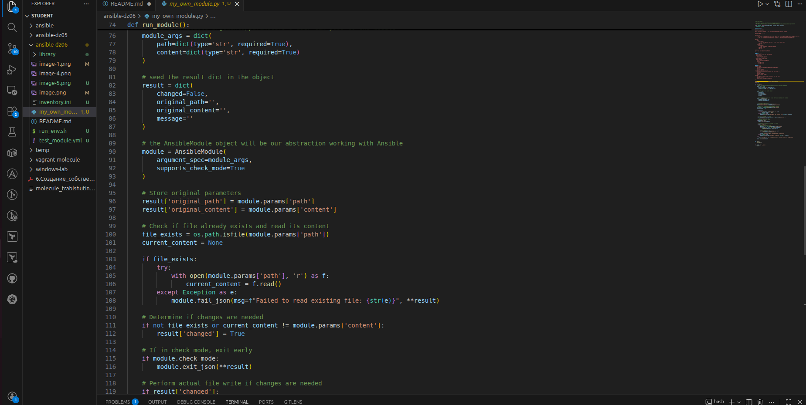

```
#!/usr/bin/python

# Copyright: (c) 2018, Terry Jones <terry.jones@example.org>
# GNU General Public License v3.0+ (see COPYING or https://www.gnu.org/licenses/gpl-3.0.txt)
from __future__ import (absolute_import, division, print_function)
__metaclass__ = type

DOCUMENTATION = r'''
---
module: my_test

short_description: This is my test module

# If this is part of a collection, you need to use semantic versioning,
# i.e. the version is of the form "2.5.0" and not "2.4".
version_added: "1.0.0"

description: This is my longer description explaining my test module.

options:
    name:
        description: This is the message to send to the test module.
        required: true
        type: str
    new:
        description:
            - Control to demo if the result of this module is changed or not.
            - Parameter description can be a list as well.
        required: false
        type: bool
# Specify this value according to your collection
# in format of namespace.collection.doc_fragment_name
extends_documentation_fragment:
    - my_namespace.my_collection.my_doc_fragment_name

author:
    - Your Name (@yourGitHubHandle)
'''

EXAMPLES = r'''
# Pass in a message
- name: Test with a message
  my_namespace.my_collection.my_test:
    name: hello world

# pass in a message and have changed true
- name: Test with a message and changed output
  my_namespace.my_collection.my_test:
    name: hello world
    new: true

# fail the module
- name: Test failure of the module
  my_namespace.my_collection.my_test:
    name: fail me
'''

RETURN = r'''
# These are examples of possible return values, and in general should use other names for return values.
original_message:
    description: The original name param that was passed in.
    type: str
    returned: always
    sample: 'hello world'
message:
    description: The output message that the test module generates.
    type: str
    returned: always
    sample: 'goodbye'
'''

from ansible.module_utils.basic import AnsibleModule


def run_module():
    # define available arguments/parameters a user can pass to the module
    module_args = dict(
        name=dict(type='str', required=True),
        new=dict(type='bool', required=False, default=False)
    )

    # seed the result dict in the object
    # we primarily care about changed and state
    # changed is if this module effectively modified the target
    # state will include any data that you want your module to pass back
    # for consumption, for example, in a subsequent task
    result = dict(
        changed=False,
        original_message='',
        message=''
    )

    # the AnsibleModule object will be our abstraction working with Ansible
    # this includes instantiation, a couple of common attr would be the
    # args/params passed to the execution, as well as if the module
    # supports check mode
    module = AnsibleModule(
        argument_spec=module_args,
        supports_check_mode=True
    )

    # if the user is working with this module in only check mode we do not
    # want to make any changes to the environment, just return the current
    # state with no modifications
    if module.check_mode:
        module.exit_json(**result)

    # manipulate or modify the state as needed (this is going to be the
    # part where your module will do what it needs to do)
    result['original_message'] = module.params['name']
    result['message'] = 'goodbye'

    # use whatever logic you need to determine whether or not this module
    # made any modifications to your target
    if module.params['new']:
        result['changed'] = True

    # during the execution of the module, if there is an exception or a
    # conditional state that effectively causes a failure, run
    # AnsibleModule.fail_json() to pass in the message and the result
    if module.params['name'] == 'fail me':
        module.fail_json(msg='You requested this to fail', **result)

    # in the event of a successful module execution, you will want to
    # simple AnsibleModule.exit_json(), passing the key/value results
    module.exit_json(**result)


def main():
    run_module()


if __name__ == '__main__':
    main()

```

Шаг 3. Заполните файл в соответствии с требованиями Ansible так, чтобы он выполнял основную задачу: module должен создавать текстовый файл на удалённом хосте по пути, определённом в параметре path, с содержимым, определённым в параметре content.

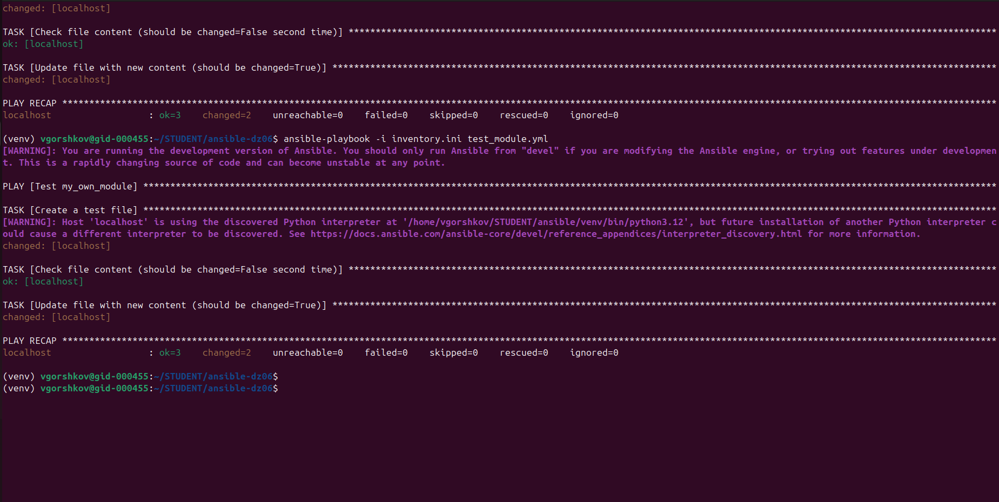

ansible-playbook -i inventory.ini test_module.yml -vvv

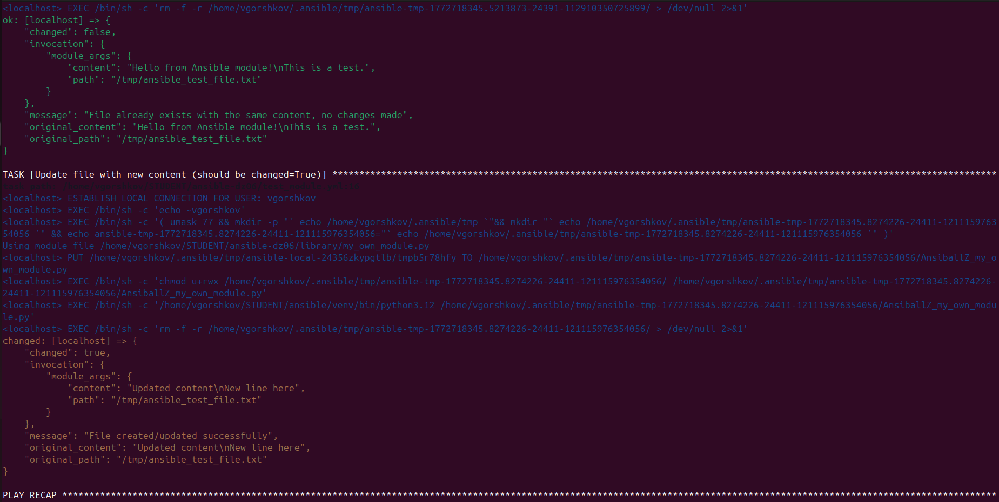


Шаг 4. Проверьте module на исполняемость локально.

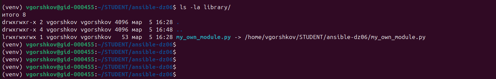

Делаем модуль исполняемым

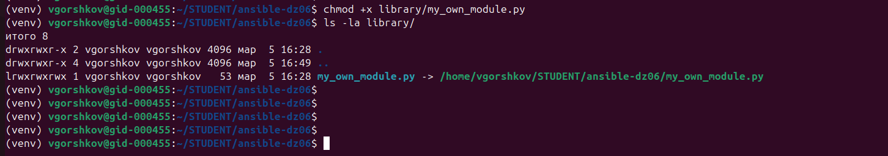

Файл пересоздается при последующих запусках.

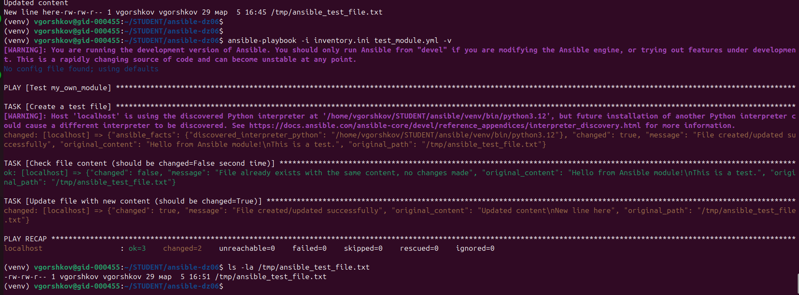

```
TASK [Check file content (should be changed=False second time)] 
ok: [localhost] => {"changed": false, ...}
```


Шаг 5. Напишите single task playbook и используйте module в нём.

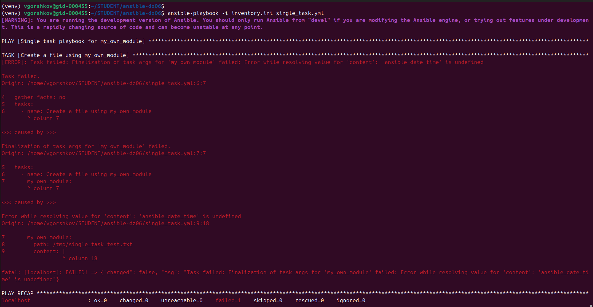

фиксим:

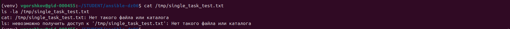

Включаем сбор фактов:

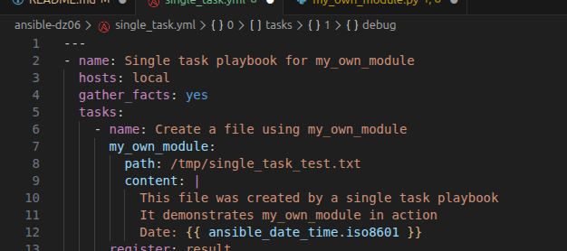

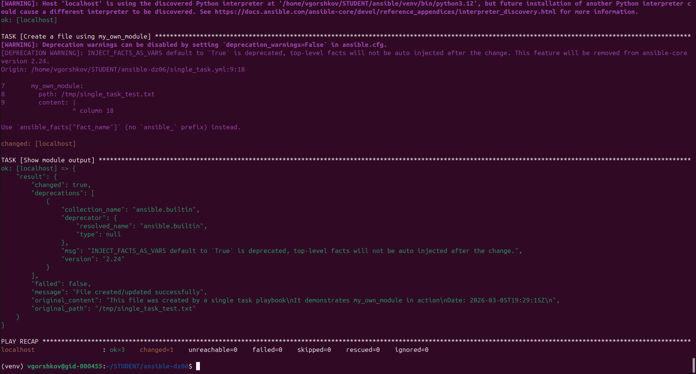

Шаг 6. Проверьте через playbook на идемпотентность.

проверка иденпотентности.
не видно иденпотентность.
думаю из-за того что дата меняется.
```
(venv) vgorshkov@gid-000455:~/STUDENT/ansible-dz06$ ansible-playbook -i inventory.ini single_task.yml
[WARNING]: You are running the development version of Ansible. You should only run Ansible from "devel" if you are modifying the Ansible engine, or trying out features under development. This is a rapidly changing source of code and can become unstable at any point.

PLAY [Single task playbook for my_own_module] ******************************************************************************************************************************************

TASK [Gathering Facts] *****************************************************************************************************************************************************************
[WARNING]: Host 'localhost' is using the discovered Python interpreter at '/home/vgorshkov/STUDENT/ansible/venv/bin/python3.12', but future installation of another Python interpreter could cause a different interpreter to be discovered. See https://docs.ansible.com/ansible-core/devel/reference_appendices/interpreter_discovery.html for more information.
ok: [localhost]

TASK [Create a file using my_own_module] ***********************************************************************************************************************************************
[WARNING]: Deprecation warnings can be disabled by setting `deprecation_warnings=False` in ansible.cfg.
[DEPRECATION WARNING]: INJECT_FACTS_AS_VARS default to `True` is deprecated, top-level facts will not be auto injected after the change. This feature will be removed from ansible-core version 2.24.
Origin: /home/vgorshkov/STUDENT/ansible-dz06/single_task.yml:9:18

7       my_own_module:
8         path: /tmp/single_task_test.txt
9         content: |
                   ^ column 18

Use `ansible_facts["fact_name"]` (no `ansible_` prefix) instead.

changed: [localhost]

TASK [Show module output] **************************************************************************************************************************************************************
ok: [localhost] => {
    "result": {
        "changed": true,
        "deprecations": [
            {
                "collection_name": "ansible.builtin",
                "deprecator": {
                    "resolved_name": "ansible.builtin",
                    "type": null
                },
                "msg": "INJECT_FACTS_AS_VARS default to `True` is deprecated, top-level facts will not be auto injected after the change.",
                "version": "2.24"
            }
        ],
        "failed": false,
        "message": "File created/updated successfully",
        "original_content": "This file was created by a single task playbook\nIt demonstrates my_own_module in action\nDate: 2026-03-05T19:29:15Z\n",
        "original_path": "/tmp/single_task_test.txt"
    }
}

PLAY RECAP *****************************************************************************************************************************************************************************
localhost                  : ok=3    changed=1    unreachable=0    failed=0    skipped=0    rescued=0    ignored=0   

(venv) vgorshkov@gid-000455:~/STUDENT/ansible-dz06$ 
(venv) vgorshkov@gid-000455:~/STUDENT/ansible-dz06$ 
(venv) vgorshkov@gid-000455:~/STUDENT/ansible-dz06$ 
(venv) vgorshkov@gid-000455:~/STUDENT/ansible-dz06$ 
(venv) vgorshkov@gid-000455:~/STUDENT/ansible-dz06$ ansible-playbook -i inventory.ini single_task.yml
[WARNING]: You are running the development version of Ansible. You should only run Ansible from "devel" if you are modifying the Ansible engine, or trying out features under development. This is a rapidly changing source of code and can become unstable at any point.

PLAY [Single task playbook for my_own_module] ******************************************************************************************************************************************

TASK [Gathering Facts] *****************************************************************************************************************************************************************
[WARNING]: Host 'localhost' is using the discovered Python interpreter at '/home/vgorshkov/STUDENT/ansible/venv/bin/python3.12', but future installation of another Python interpreter could cause a different interpreter to be discovered. See https://docs.ansible.com/ansible-core/devel/reference_appendices/interpreter_discovery.html for more information.
ok: [localhost]

TASK [Create a file using my_own_module] ***********************************************************************************************************************************************
[WARNING]: Deprecation warnings can be disabled by setting `deprecation_warnings=False` in ansible.cfg.
[DEPRECATION WARNING]: INJECT_FACTS_AS_VARS default to `True` is deprecated, top-level facts will not be auto injected after the change. This feature will be removed from ansible-core version 2.24.
Origin: /home/vgorshkov/STUDENT/ansible-dz06/single_task.yml:9:18

7       my_own_module:
8         path: /tmp/single_task_test.txt
9         content: |
                   ^ column 18

Use `ansible_facts["fact_name"]` (no `ansible_` prefix) instead.

changed: [localhost]

TASK [Show module output] **************************************************************************************************************************************************************
ok: [localhost] => {
    "result": {
        "changed": true,
        "deprecations": [
            {
                "collection_name": "ansible.builtin",
                "deprecator": {
                    "resolved_name": "ansible.builtin",
                    "type": null
                },
                "msg": "INJECT_FACTS_AS_VARS default to `True` is deprecated, top-level facts will not be auto injected after the change.",
                "version": "2.24"
            }
        ],
        "failed": false,
        "message": "File created/updated successfully",
        "original_content": "This file was created by a single task playbook\nIt demonstrates my_own_module in action\nDate: 2026-03-05T19:36:40Z\n",
        "original_path": "/tmp/single_task_test.txt"
    }
}

PLAY RECAP *****************************************************************************************************************************************************************************
localhost                  : ok=3    changed=1    unreachable=0    failed=0    skipped=0    rescued=0    ignored=0   

(venv) vgorshkov@gid-000455:~/STUDENT/ansible-dz06$ 

```


Шаг 7. Выйдите из виртуального окружения.

Шаг 8. Инициализируйте новую collection: ansible-galaxy collection init my_own_namespace.yandex_cloud_elk.

Шаг 9. В эту collection перенесите свой module в соответствующую директорию.

Шаг 10. Single task playbook преобразуйте в single task role и перенесите в collection. У role должны быть default всех параметров module.

Шаг 11. Создайте playbook для использования этой role.

Шаг 12. Заполните всю документацию по collection, выложите в свой репозиторий, поставьте тег 1.0.0 на этот коммит.

Шаг 13. Создайте .tar.gz этой collection: ansible-galaxy collection build в корневой директории collection.

Шаг 14. Создайте ещё одну директорию любого наименования, перенесите туда single task playbook и архив c collection.

Шаг 15. Установите collection из локального архива: ansible-galaxy collection install <archivename>.tar.gz.

Шаг 16. Запустите playbook, убедитесь, что он работает.

Шаг 17. В ответ необходимо прислать ссылки на collection и tar.gz архив, а также скриншоты выполнения пунктов 4, 6, 15 и 16.
Необязательная часть

    Реализуйте свой модуль для создания хостов в Yandex Cloud.
    Модуль может и должен иметь зависимость от yc, основной функционал: создание ВМ с нужным сайзингом на основе нужной ОС. Дополнительные модули по созданию кластеров ClickHouse, MySQL и прочего реализовывать не надо, достаточно простейшего создания ВМ.
    Модуль может формировать динамическое inventory, но эта часть не является обязательной, достаточно, чтобы он делал хосты с указанной спецификацией в YAML.
    Протестируйте модуль на идемпотентность, исполнимость. При успехе добавьте этот модуль в свою коллекцию.
    Измените playbook так, чтобы он умел создавать инфраструктуру под inventory, а после устанавливал весь ваш стек Observability на нужные хосты и настраивал его.
    В итоге ваша коллекция обязательно должна содержать: clickhouse-role (если есть своя), lighthouse-role, vector-role, два модуля: my_own_module и модуль управления Yandex Cloud хостами и playbook, который демонстрирует создание Observability стека.

Как оформить решение задания

Выполненное домашнее задание пришлите в виде ссылки на .md-файл в вашем репозитории.